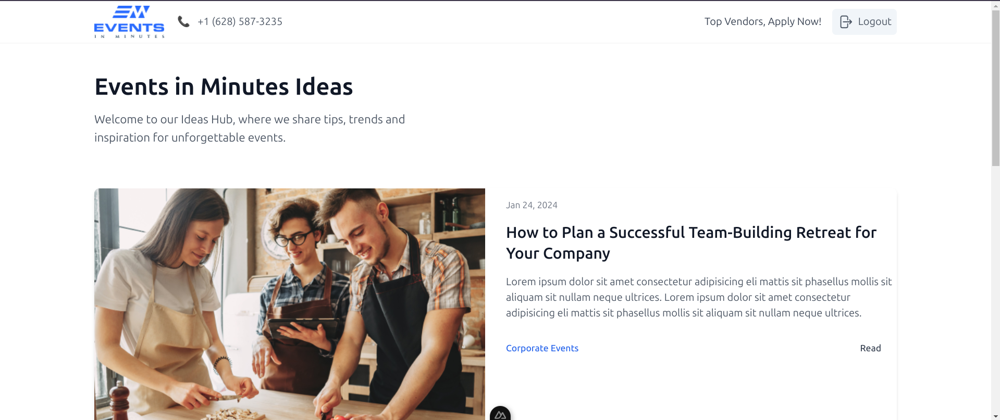

# NuxtJS Blog Application



## Overview
This is a NuxtJS blog application that demonstrates dynamic routing, user authentication, and API integration. It features a responsive UI and a simple admin login for managing content.

## Features
- Dynamic Routing for posts and categories
- User Authentication
- Responsive UI
- API Integration using JSON Server
- Admin Login

## Setup Instructions
### Prerequisites
- Node.js installed on your system
- Yarn or npm installed

### Installation
1. Clone the repository:
   ```bash
   git clone git clone https://github.com/amir1230/blogging.git
   cd nuxtjs-blog-app
   ```

### Install dependencies:
```bash
yarn install
# or
npm install
```

### Running the Application
1. Start the NuxtJS application:
```bash
yarn dev
# or
npm run dev
```
This will start the development server. Visit http://localhost:3000 to view the application.

2. Start the JSON Server
```bash
yarn json-server
```
Ensure that the JSON Server is running to provide data for the blog application.

### Admin Login
To log in as an admin, use the following credentials:

- Email: admin@admin.com
- Password: admin

### Development
This project uses NuxtJS for the frontend and JSON Server for simulating a backend API. The application fetches posts dynamically and includes a middleware for authentication.


